[](https://classroom.github.com/a/KzqfxGd5)
[](https://classroom.github.com/online_ide?assignment_repo_id=22828225&assignment_repo_type=AssignmentRepo)
# Lab02 - Caracterización de osciladores (externo vs. interno)


## 1. Integrantes

* [Liliana Carreño](https://github.com/Liliana-Carreno)
* [Salome Ramirez](https://github.com/salomeramirezpi-eng)
* [Gabriel Ortega](https://github.com/gabrieldaortegaro-arch)

### 1.1 Introducción
<p align="justify" style="text-indent:40px;">
Los osciladores son elementos fundamentales en la mayoría de dispositivos electrónicos ya que estos ayudan a sincronizar y generar las diferentes señales, asimismo al ser periodicos sirven como un referente de tiempo. En esta práctica se utilizo el microcontrolador <code>PIC18F45K22</code> y se realizaron tres montajes diferentes de osciladores para analizar las diferencias entre estos, ver cual es más estable y con cual podemos llegar a alcanzar mayor precisión.
</p>

<p align="justify" style="text-indent:40px;">
Para la realización de nuestros montajes se utilizó el oscilador interno del microcontrolador, un oscilador externo basado en cristal acompañado de dos condensadores y un oscilador RC conformado por una resistencia y un condensador. Despues, se analizó el comportamiento de cada uno de ellos frente a cambios bruscos de temperatura, especificamente al aumentarla. Igualmente se observó como cada uno de estos circuitos trabajaba junto con el PLL que es un multiplicador de frecuencia. 
</p>


### 1.2 Objetivos

* Comprender el concepto de oscilador a la vez que se identifica y reconoce la importancia de este elemento en sistemas electrónicos.

* Identificar los diferentes tipos de osciladores (RC, con cristal, INTOSC).

* Comprender como los factores externos como la temperatura pueden afectar la precisión del oscilador.

* Desarrollar habilidades de simulación, manipulación de códigos y montaje de circuitos.


## 2. Documentación

<p align="justify" style="text-indent:40px;">
Para nuestra práctica se utilizaron las mismas <b>herramientas</b> de la practica anterior junto con algunas más, vale resaltar que en este caso, un elemento fundamental para lograr el oscilador exterior fue el <b>Cristal de 16MHz</b>, este elemento es un componente diseñado para generar una señal eléctrica con una frecuencia estable y precisa. Esto funciona aplicando un voltaje al cristal, el cual se deforma y empieza  a vibrar de manera física en determinada frecuencia, que depende de la forma en la que este cortado, esta vibración se convierte en una señal eléctrica que es lo que finalmente utilizamos como referencia. Este elemento es utilizado en diferentes circuitos por su bajo costo y gran presición.
</p>

<p align="center">
  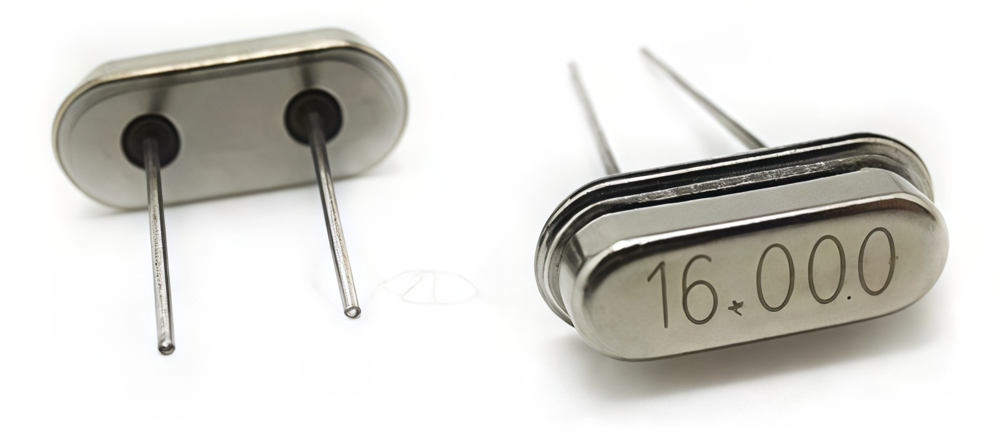<br>
  <em> <b> Figura 1.</b> Imagen de referencia del Cristal de 16MHz. </em>
</p>

### 2.1 Descripción del laboratorio

<p align="justify" style="text-indent:40px;">
El oscilador es el componente encargado de generar la señal de reloj, con el funcionan los temporizadores dentro del microcontrolador. En esta practica vamos a explorar diferentes modos de operación y como factores como la temperatura afectan su funcionamiento. 
Se usaron los siguientes elementos para cada modo:
</p>

### 1. (HS) El uso de un cristal externo de 16 MHz conectado a los pines OSC1 y OSC2.
<p align="center">
  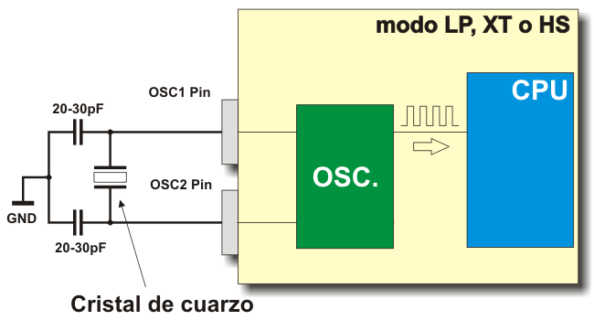<br>
  <em> <b> Figura 2.</b> Imagen de referencia de la conexión del Oscilador con Cristal. </em>
</p>

### 2.(INTIO67) Uso del oscilador interno, cuya frecuencia se controla mediante el registro OSCCON.
<p align="center">
  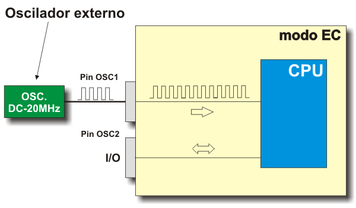<br>
  <em> <b> Figura 3.</b> Imagen de referencia de la conexión del Oscilador Interno (INTOSC). </em>
</p>

### 3.(RC) Empleando un circuito RC externo. 
<p align="center">
  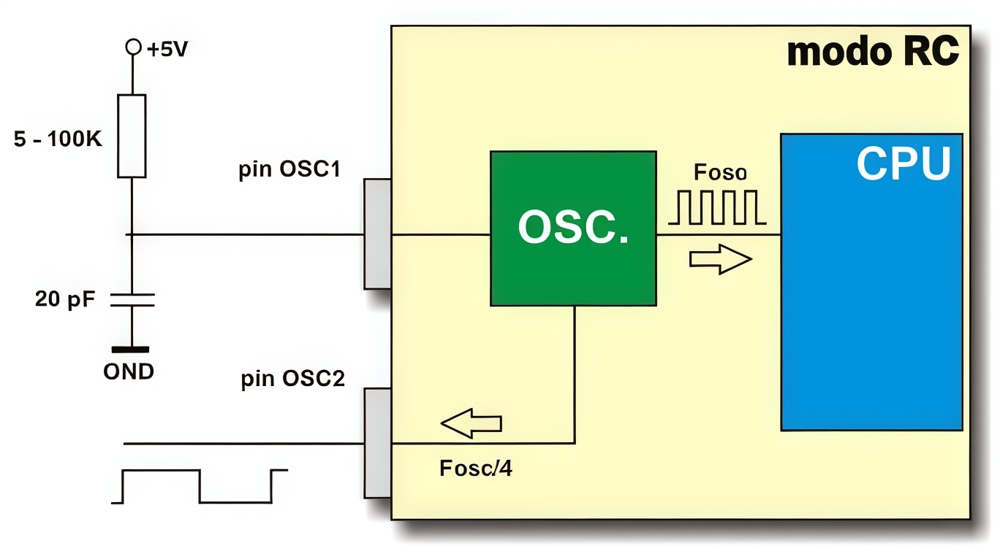<br>
  <em> <b> Figura 4.</b> Imagen de referencia de la conexión del Oscilador RC. </em>
</p>

<p align="justify" style="text-indent:40px;">
Para verificar la frecuencia del sistema, el programa genera una señal periódica aproximada de 500 Hz en el pin RC0, la cual se mide con un osciloscopio y adicionalmente se tiene la presencia de un led.
</p>

<p align="justify" style="text-indent:40px;">
Primero se realizan los montajes de cada modo, donde en el primer modo es necesario modificar el valor de la frecuencia del oscilador, pero para el oscilador RC externo la frecuencia depende del circuito formado por la resistencia y el capacitor asi que se calcula el valor de la resistencia. Seguidamente, la frecuencia medida se compara con la frecuencia teórica para calcular el porcentaje de error. Además, se evalúa la deriva térmica calentando ligeramente el agente responsable de la oscilación en cada modo y observando posibles variaciones en la señal generada. Y de esta forma poder comprender las diferencias entre ambas fuentes de reloj, en términos de precisión, estabilidad y sensibilidad a cambios de temperatura en los sistemas.
</p>

### 2.2 Explicación del código implementado

````c
#include <xc.h>
#include <stdint.h>
````
<p align="justify" style="text-indent:40px;">
El programa inicia con la inclusión de las bibliotecas xc.h y stdint.h. La primera contiene las definiciones y configuraciones específicas del  PIC18F45K22, la segunda stdint.h permite utilizar tipos de datos de tamaño fijo, como uint16_t, lo que asegura que las variables ocupen un número de bits definido y evitando inconsistencias entre compiladores o arquitecturas.
</p>


````c
#pragma config WDTEN = OFF      
#pragma config LVP = OFF        
#pragma config PBADEN = OFF     
#pragma config CP0 = OFF, CP1 = OFF, CP2 = OFF, CP3 = OFF  
#pragma config BOREN = OFF      
#pragma config FCMEN = OFF      
#pragma config IESO = OFF
````
<p align="justify" style="text-indent:40px;">
Este bloque corresponde a configuraciones generales del microcontrolador mediante una especie de "Condiciones Iniciales" #pragma config. Determinando el comportamiento del hardware desde el arranque del sistema. En este caso se desactiva el temporizador watchdog para evitar reinicios automáticos del programa, se deshabilita la programación en bajo voltaje para liberar pines de uso general y se configura el puerto B para trabajar como digital. También se desactiva la protección de código para acceder libremente al programa almacenado en la memoria y se deshabilitan funciones de supervisión del reloj como el monitor de fallo de reloj y el cambio automático entre osciladores, con el objetivo de mantener fija la fuente de reloj.
</p>

````c
#define MODE 1
#if MODE == 1
    #pragma config FOSC = INTIO67
    #define USE_PLL 0
#elif MODE == 2
    #pragma config FOSC = HSHP
    #define USE_PLL 0
#elif MODE == 3
    #pragma config FOSC = RC
    #define USE_PLL 0
#else
    #error "Modo de oscilador inválido"
#endif
````
<p align="justify" style="text-indent:40px;">
En la  primera linea define el modo de operación del oscilador. Esta constante permite seleccionar qué tipo de fuente de reloj utilizará el microcontrolador durante la ejecución del programa(1,2,3). Seguidamente el bloque utiliza  "if" para configurar el tipo de oscilador que utilizará el microcontrolador. Cuando el modo seleccionado es el primero, el sistema se configura para utilizar el oscilador interno del microcontrolador. Si es el segundo caso, se utiliza un cristal externo de alta velocidad conectado a los pines del oscilador, y en el tercer caso se utiliza un oscilador RC externo formado por una resistencia y un capacitor. Si no es ninguno de estos casos, el compilador genera un Modo de oscilador inválido".
</p>

````c
#if MODE == 1 || MODE == 2
    #if USE_PLL
        #define _XTAL_FREQ 64000000UL
    #else
        #define _XTAL_FREQ 350000000UL
    #endif
#else
    #define _XTAL_FREQ 16000000UL
#endif
````
<p align="justify" style="text-indent:40px;">
En este bloque se define la constante _XTAL_FREQ, que representa la frecuencia del oscilador. Dependiendo del modo seleccionado, la frecuencia puede corresponder al oscilador interno o al cristal externo. Si se habilita el módulo PLL, la frecuencia base se multiplica por 4 para obtener una frecuencia de operación mayor.
</p>


````c
void delay_ms(uint16_t ms) {
    while(ms--) {
        __delay_ms(1);
    }
}
````
<p align="justify" style="text-indent:40px;">
Esta función permite generar retardos en milisegundos dentro del programa con uint16_t ms utiliza un ciclo repetitivo que ejecuta la función __delay_ms(1) cada vez. 
</p>

````c
void init_pins(void) {
    TRISCbits.TRISC0 = 0;
    LATCbits.LATC0 = 0;

    if(MODE == 1 || (MODE == 2 && USE_PLL)) {
        TRISAbits.TRISA6 = 0;
        LATAbits.LATA6 = 0;
    }
}
````
<p align="justify" style="text-indent:40px;">
Esta otra función se encarga de configurar los pines. El pin RC0 se configura como salida digital mediante el registro TRISC y se establece su estado inicial en nivel lógico "0" utilizando el registro LATC. Tambien dependiendo del modo de oscilador seleccionado, el pin RA6 puede configurarse como salida digital para permitir la observación de la señal de reloj del sistema.
</p>

````c
void init_oscillator(void) {
#if USE_PLL
    OSCCONbits.SPLLEN = 1;
#endif
}
````
<p align="justify" style="text-indent:40px;">
Y esta función se encarga de configurar la posibilidad de habilitar el módulo PLL que multiplica la frecuencia del oscilador, si esta opción se encuentra activada, el programa habilita el bit correspondiente dentro del registro OSCCON para acticar el multiplicador interno.
</p>


````c
void main(void) {
    init_pins();
    init_oscillator();

    while(1) {
        LATCbits.LATC0 = 1;
        delay_ms(1);
        LATCbits.LATC0 = 0;
        delay_ms(1);
    }
}
````
<p align="justify" style="text-indent:40px;">
Finalmente bloque corresponde al programa principal. Se ejecutan las funciones de inicialización que configuran los pines y el sistema de reloj del microcontrolador. Y se ejecuta un ciclo infinito donde se controla el estado del pin RC0. El programa coloca el pin en "1", espera un milisegundo utilizando la función de retardo y luego lo coloca en "0", esperando nuevamente un milisegundo antes de repetir el proceso. 
</p>


### 2.3 Análisis y comparación

#### Tabla 1: Medición en frío

| Modo de oscilador | Freq. teórica Fosc | RA6 medible (CLKO)? | Freq. medida RA6 (Hz) | Freq. teórica RC0 (Hz)| Freq. medida RC0 (Hz) | Error RC0 (%) |  
|------------------|------------------|---------------------|---------------|---------------------|---------------|---------------|
| INTOSC (interno) | 16,000,000       | Sí                 |           77          |                500                 |   79            |         84.2      | |
| HS (cristal externo 16 MHz) | 16,000,000 | No |     NA      |               500                 |509.4               |       1.88        |
| RC externo       | ~16,000,000*     | No                                    |       N/A        | 500                 |   407.3            |       18.54        | |

<p align="justify" style="text-indent:40px;">
La tabla muestra la comparación entre la frecuencia teórica y la frecuencia medida de tres modos de oscilador del microcontrolador PIC18F45K22 en temperatura normal, antes de calentarlo. El oscilador interno (INTOSC) presentó un error muy alto (84.2 %), ya que la frecuencia medida fue mucho menor que la teórica. El cristal externo (HS) fue el más preciso, con una frecuencia muy cercana a la esperada y un error pequeño de 1.88 %. Por otro lado, el oscilador RC externo tuvo un error intermedio de 18.54 %. En general, el cristal externo fue el más estable, mientras que el oscilador interno fue el menos preciso en esta prueba.
</p>

#### Tabla 2: Medición con calor

| Modo de oscilador | Freq. teórica Fosc | RA6 medible (CLKO)? | Freq. medida RA6 (Hz) | Freq. teórica RC0 (Hz)| Freq. medida RC0 (Hz) | Error RC0 (%) |  
|------------------|------------------|---------------------|---------------|---------------------|---------------|---------------|
| INTOSC (interno) | 16,000,000       | Sí                 |                     |                500                 |        32.6       |          93.48     | |
| HS (cristal externo 16 MHz) | 16,000,000 | No |     NA      |               500                 |503.8               |         0.76      |
| RC externo       | ~16,000,000*     | No                                    |       N/A        | 500                 |           422.39    |        15.522       | |

<p align="justify" style="text-indent:40px;">
La tabla muestra las mediciones cuando se calentó el oscilador del microcontrolador PIC18F45K22. El oscilador interno (INTOSC) presentó un error aún mayor, llegando a 93.48 %, ya que la frecuencia medida fue de 32.6 Hz en lugar de 500 Hz. El cristal externo (HS) siguió siendo el más estable, con una frecuencia de 503.8 Hz y un error muy pequeño de 0.76 %. Por su parte, el oscilador RC externo tuvo un error de 15.52 %, mostrando una variación moderada. En general, incluso con el aumento de temperatura, el cristal externo sigue siendo el más preciso, mientras que el oscilador interno es el más afectado por el calor.
</p>

#### Tabla 3: Deriva
           
<div align="center">

| Modo de oscilador | RC0 deriva (Hz) |
|------------------|----------------|
| INTOSC (interno) | 421 |
| HS (cristal externo 16 MHz) | 9.4 |
| RC externo | 92.4 |

</div>

<p align="justify" style="text-indent:40px;">
La tabla muestra la deriva de frecuencia, es decir, la diferencia entre la frecuencia teórica y la medida para cada modo de oscilador del microcontrolador. El oscilador interno (INTOSC) presentó la mayor variación con 421 Hz, lo que indica que es el más afectado por cambios como la temperatura. El cristal externo (HS) tuvo la menor deriva con 9.4 Hz, mostrando una alta estabilidad y precisión. Por otro lado, el oscilador RC externo presentó una deriva intermedia de 92.4 Hz. En conclusión, el análisis general nos muestra que el cristal externo es el más estable y preciso, mientras que el oscilador interno es el que más se ve afectado por las condiciones externas.
</p>

<!-- Agregar tablas para valores usando PLL -->


## 2.4 Diagramas

<p align="justify" style="text-indent:40px;">
Inicialmente se desarrollaron las simulaciones con el propósito de realizar una comparativa de los resultados del montaje, sin embargo la respuesta del simulador fue irregular, ya que en los casos de los osciladores con componentes externos no reaccionaba al cambio o ausencia de estos componentes.
</p>

<p align="justify" style="text-indent:40px;">
Para evidenciar visualmente el funcionamiento del circuito con el oscilador interno del microcontrolador PIC18F45K22,se muestra el oscilograma de la señal generada.
</p>

<p align="center">
  <br>
  <em> <b> Figura 5.</b> Simulación realizada en proteus del oscilador interno. </em>
</p>

<p align="justify" style="text-indent:40px;">
En el caso del oscilador RC externo.A continuación se presenta el oscilograma correspondiente a la señal obtenida.
</p>

<p align="center">
  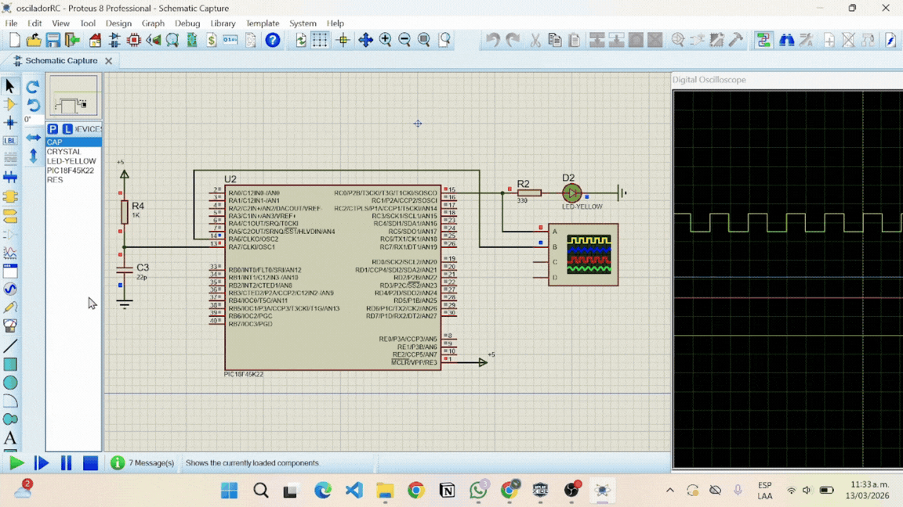<br>
  <em> <b> Figura 6.</b> Simulación realizada en proteus del oscilador RC. </em>
</p>

<p align="justify" style="text-indent:40px;">
Para el oscilador basado en cristal de cuarzo.A continuación se muestra el oscilograma de la señal resultante.
</p>

<p align="center">
  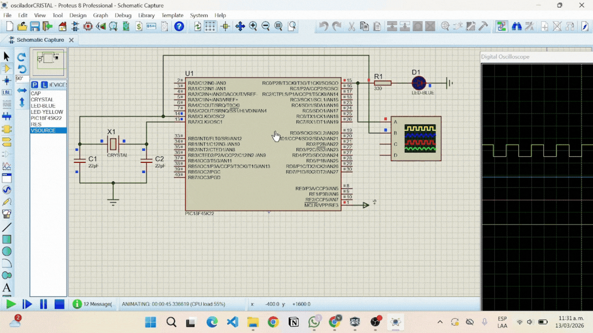<br>
  <em> <b> Figura 7.</b> Simulación realizada en proteus del oscilador con Cristal de Cuarzo. </em>
</p>

## 2.5 Formas de onda

<p align="justify" style="text-indent:40px;">
<b>INTOSC (interno): </b> En este oscilograma podemos observar una señal cuadrada que tiene un gran porcentaje de simetría, presenta un voltaje pico a pico de casi 5V y el valor son los 500Hz que se pedían vemos una señal que presenta cierto nivel de ruido, pero fue fácil de leer con el osciloscopio y se mantenía muy estable. 
</p>

<p align="center">
  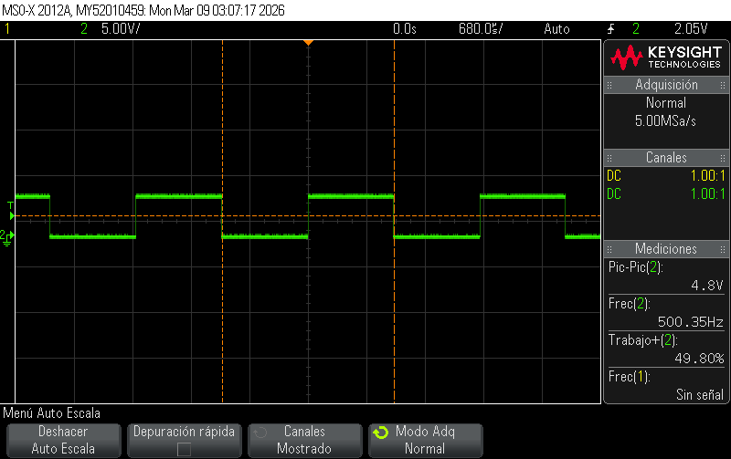<br>
  <em> <b> Figura 8.</b> Oscilograma del INTOSC (interno). </em>
</p>

<p align="justify" style="text-indent:40px;">
<b>HS (Oscilador con Cristal):</b>Al utilizar el cristal de cuarzo algo que resaltamos es que la frecuencia se mantenía muy estable, sin embargo, el nivel de ruido en comparación con el anterior es mucho mayor, a su vez el voltaje de salida fue de 2,89V lo que es casi la mitad del voltaje de salida que lográbamos con el oscilador interno.
</p>

<p align="center">
  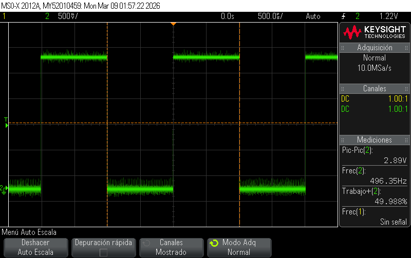<br>
  <em> <b> Figura 9.</b> Oscilograma del Cristal. </em>
</p>

<p align="justify" style="text-indent:40px;">
<b>RC (Resistencia-Capacitor):</b> Este ultimo oscilograma nos muestra que un voltaje de salida de 5.23V el cual es el mayor de los tres osciladores, de igual forma en este caso la frecuencia se nos pasó un poco, aunque esto también se puede deber a que los valores de los componentes calculados ya que no siempre concuerdan con los valores que encontramos comercialmente. 
</p>


<p align="center">
  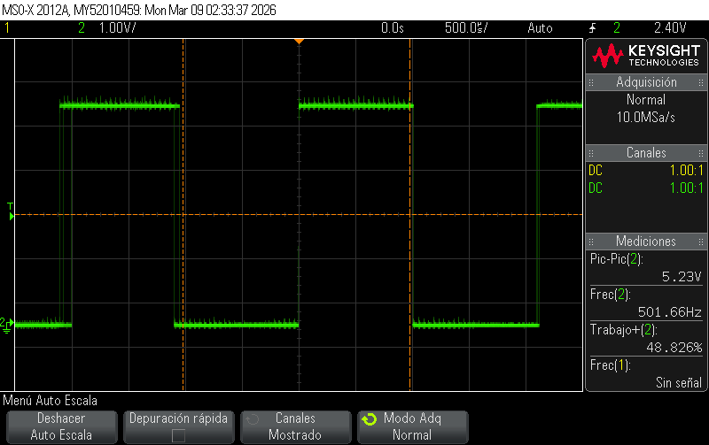<br>
  <em> <b> Figura 10.</b> Oscilograma del RC. </em>
</p>

## 3. Evidencias de implementación

<p align="justify" style="text-indent:40px;">
Al presentar la práctica, se iba mostrando a su vez el circuito montado y funcionando a una <b>frecuencia de 500Hz</b>, esta frecuencia no es perceptible para el ojo humano, por lo tanto la siguientes evidencias son de la implementación de cada uno de los osciladores a una frecuencia menor para que se logre percibir el parpadeo de un LED.
</p>

### INTOSC (interno):  

<p align="justify" style="text-indent:40px;"> 
Nuestro primer circuito con la utilización del <b>oscilador interno</b>, consta de el PIC la conexión basica de este al PICKIT, acompañado de la resistencia y el LED. Es una conexión simple y para que funcionase este modo primero lo más importante era ajustar la _XTAL_FREQ dependiendo de que valor de frecuencia nesecitasemos.
</p>

<p align="center">
  <br>
  <em> <b> Figura 11.</b> Montaje circuito oscilador INTOSC (interno). </em>
</p>

<p align="justify" style="text-indent:40px;"> 
Para evidenciar visualmente el funcionamiento del circuito con el oscilador interno del microcontrolador PIC18F45K22, se redujo la frecuencia modificando el valor configurado en el código.
A continuación se muestra el oscilograma de la señal generada, ajustada a una frecuencia observable mediante el titileo del LED.
</p>

<p align="center">
  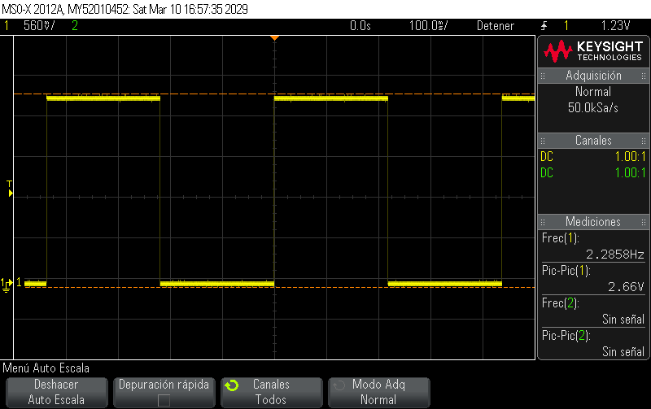<br>
  <em> <b> Figura 12.</b> Oscilograma INTOSC (interno) con el LED titilando. </em>
</p>

### HS Oscilador con Cristal:

<p align="justify" style="text-indent:40px;"> 
Nuestro segundo circuito con el <b>cristal</b>, consta de el PIC la conexión basica de este al PICKIT, acompañado del oscilador de 16Mhz jutno con un condensaddor en cada una de sus terminales y estos van conectados a tierra, tambien se modifico la frecuencia desde el codigo y se verifico que el valor de los condensadores funcionase bien para este ejercicio.
</p>

<p align="center">
  <br>
  <em> <b> Figura 13.</b> Montaje circuito oscilador con Cristal de Cuarzo. </em>
</p>

<p align="justify" style="text-indent:40px;"> 
Para el oscilador basado en cristal de cuarzo, la frecuencia observable se ajustó modificando los valores de los capacitores asociados al cristal.
A continuación se muestra el oscilograma de la señal resultante, configurada a una frecuencia que permite observar el titileo del LED.
</p>

<p align="center">
  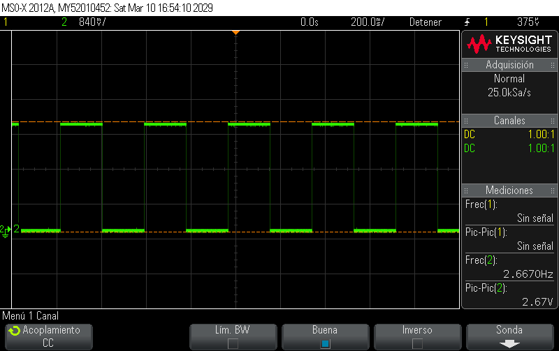<br>
  <em> <b> Figura 14.</b> Oscilograma con Cristal y LED titilando. </em>
</p>

### RC

<p align="justify" style="text-indent:40px;"> 
Finalmente el ultimo circuito, <b>RC</b>, consta de el PIC la conexión basica de este al PICKIT, acompañado de una conexión de condensador-resistencia, la cual se calculaba para lograr establecer la frecuencia deseada. En este último las modificaciones a la frecuencia las estableciamos por medio de los componentes.
</p>

<p align="center">
  <br>
  <em> <b> Figura 15.</b> Montaje circuito oscilador con RC. </em>
</p>

<p align="justify" style="text-indent:40px;"> 
En el caso del oscilador RC externo, la frecuencia del circuito se redujo modificando el valor de la resistencia del arreglo RC.
A continuación se presenta el oscilograma correspondiente a la señal obtenida, ajustada a una frecuencia visible para observar el titileo del LED.
</p>

<p align="center">
  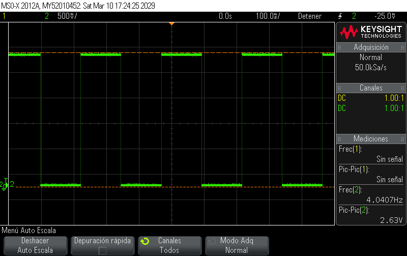<br>
  <em> <b> Figura 16.</b> Oscilograma con RC y LED titilando. </em>
</p>

## 4. Preguntas

* ¿En qué modo se obtuvo la medición más cercana a la frecuencia teórica?

<p align="justify" style="text-indent:40px;">
 La medición mas cercana a la teórica fue la del oscilador interno con 500.35Hz.
 </p>

* ¿Fue posible evidenciar el fenómeno de deriva? ¿Qué factores podrían explicar la variación de frecuencia al calentar el PIC?

<p align="justify" style="text-indent:40px;">
Sí fue posible evidenciar el fenómeno de deriva, ya que al aumentar la temperatura se observaron cambios en la frecuencia medida de los osciladores, en dos de ellos bajo mientras que en RC aumento, pensamos que esto ocurre porque la temperatura altera parámetros eléctricos internos del microcontrolador y de los componentes externos. En el caso del RC, la resistencia y la capacitancia varían con la temperatura, mientras que en el oscilador interno cambian propiedades del circuito electrónico.
</p>

* ¿Cuál es más preciso en cuanto a frecuencia teórica vs. medida?

<p align="justify" style="text-indent:40px;">
El oscilador de cristal fue el que tuvo mas estabilidad por lo que presenta un porcentaje de error a los demás, esto es principalmente debido al cristal de cuarzo.
</p>

* Explique cómo usar RC0 para estimar la frecuencia del oscilador cuando RA6 no está disponible.

<p align="justify" style="text-indent:40px;">
Cuando el pin RA6 no está disponible para observar la señal de reloj del sistema, se puede estimar la frecuencia del oscilador midiendo la señal generada en el pin RC0. El programa genera una señal periódica mediante retardos que dependen directamente de la frecuencia del oscilador del microcontrolador. Al medir con un osciloscopio la frecuencia real de esta señal, es posible estimar indirectamente la frecuencia real del sistema.
</p>

* Si se quisiera duplicar la frecuencia del PIC usando PLL, ¿en qué modos se podría aplicar?

<p align="justify" style="text-indent:40px;">
El módulo PLL puede utilizarse en modos  1 y 2, el oscilador interno o el oscilador externo basado en cristal. En estos casos el PLL multiplica la frecuencia base del sistema, permitiendo aumentar la velocidad de operación del microcontrolador.
</p>

* Enliste ventajas y desventajas de cada modo.

<p align="justify" style="text-indent:40px;">
El oscilador interno tiene como principal ventaja que no requiere componentes externos y es mas simple, aunque presenta menor precisión y mayor sensibilidad a cambios de temperatura. El oscilador con cristal externo ofrece la mayor estabilidad y precisión en la frecuencia, pero requiere componentes adicionales. El oscilador RC externo es sencillo y económico de implementar pero no es tan preciso por la dependencia de las tolerancias de la resistencia y el capacitor.
</p>

## 5. Conclusiones

* Los osciladores son elementos fundamentales para los circuitos electrónicos, estos permiten que las señales se sincronicen y son un referente de tiempo para muchos circuitos, de igual forma los osciladores permiten generar otras señales o pulsos que constantes que se pueden usar en contadores, relojes, entre otras aplicaciones.

* De los tres osciladores desarrollados en clase, se pudo observar que con el que conseguíamos mayor voltaje de salida fue el del RC, ya que en las modificaciones realizadas este siempre mantuvo mayor voltaje que los otros.

* Hemos de tener en cuenta que los factores externos tales como la temperatura afectan la respuesta de los osciladores, esto se pudo evidenciar al aumentar la temperatura de los componentes observando lo que se conoce como deriva y de los tres el que mantuvo mayor estabilidad fue el del cristal de cuarzo.

## 6. Referencias

* Agarwal, T. (2020, June 4). Overview of Crystal Oscillator Circuit Working with applications. ElProCus - Electronic Projects for Engineering Students. https://www.elprocus.com/crystal-oscillator-circuit-and-working/

* Microcontroladores_ECCI_2026-I/labs/02_lab02/README.md at main · jharamirezma/Microcontroladores_ECCI_2026-I. (n.d.). GitHub. https://github.com/jharamirezma/Microcontroladores_ECCI_2026-I/blob/main/labs/02_lab02/README.md

